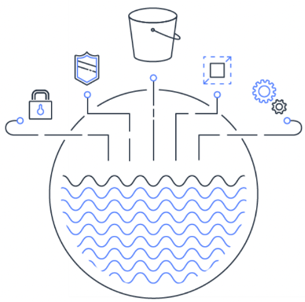

# AWS의 몇가지 서비스를 활용한 워크샵: data-Engineering-hol-kr

기존 [data-Engineering-hol](https://catalog.us-east-1.prod.workshops.aws/workshops/976050cc-0606-4b23-b49f-ca7b8ac4b153/en-US/)을 한글화 하고, 실습자에게 필요한 부분만 정리하여 구성합니다.

# Data Engineering Immersion Day 개요

Data Engineering Immersion Day란?
Data Engineering Imposition Day에서는 AWS의 데이터 레이크 관점에서의 데이터 수집, 공급, 탐색 및 소비에 초점을 맞춘 실습을 수행 합니다.
본 HoL에서는 여러분의 IDC에 위치했다고 가정한 원본 데이터베이스의 수집을 위한 [AWS DMS(데이터 마이그레이션 서비스)](https://docs.aws.amazon.com/ko_kr/dms/latest/userguide/Welcome.html), 데이터 카탈로그 및 실행을 위한 [AWS GLUE](https://docs.aws.amazon.com/ko_kr/glue/latest/dg/what-is-glue.html), 데이터 레이크를 위해 S3를 쿼리하고 뷰테이블을 생성하는 [AMAZON Athena](https://docs.aws.amazon.com/ko_kr/athena/latest/ug/what-is.html), 최종적으로 정제된 데이터의 시각화를 위한 [AMAZON QuickSight](https://aws.amazon.com/ko/quicksight/) 등 AWS 분석 서비스를 직접 이용할 수 있는 경험을 제공합니다.
본 Immersion Day를 수행하면 클라우드 네이티브 및 서버리스 데이터 레이크를 구축하는 데 도움이 될 수 있습니다.

## [1.Introduction](./detail/introduction)

