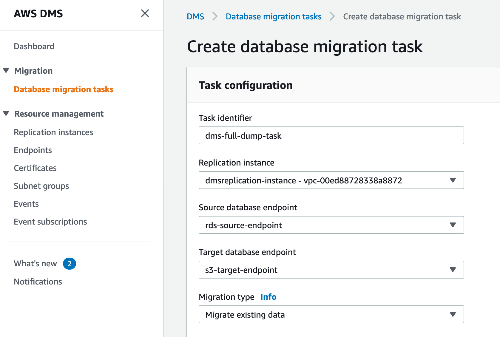
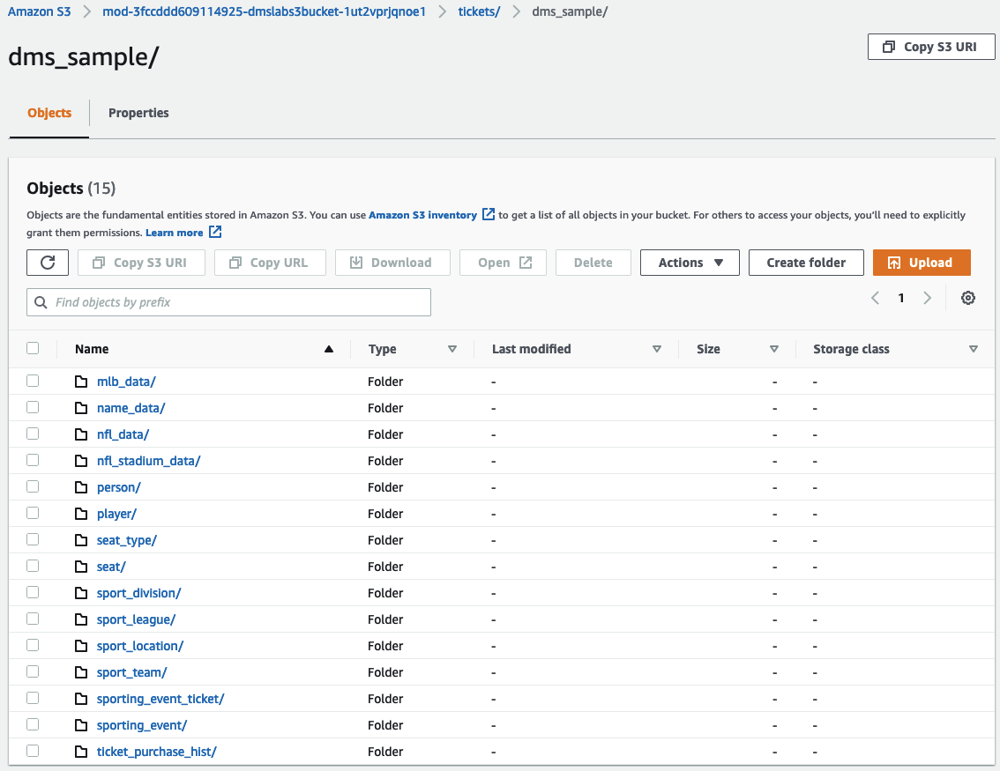
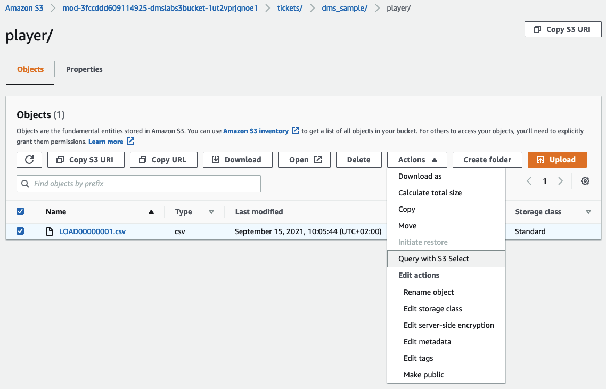

# 2-2. DMS Full Load

이 실습은 실질적인 DMS 데이터 마이그레이션 작업 (소스로부터 타겟으로 데이터 풀 복제) 을 수행하게 됩니다.

### Initial full copy 수행을 위한 Task 생성

#### 1. DMS 콘솔에서, **Database migration tasks** 를 선택합니다.

#### 2. Create Task 를 클릭합니다.


***

```
    a. Task Identifier 에는, 쉽게 알아볼 수 있는 태스크 이름을 입력합니다. e.g. `dms-full-dump-task`
    b. Replication instance 에, 매칭되는 자원을 선택합니다.
    c. Source database endpoint 에, 매칭되는 자원을 선택합니다.
    d. Target database endpoint 에, 매칭되는 자원을 선택합니다.
    e. Migration type 에, **Migrate existing data** 를 선택합니다.
```



```
    f. Task Settings 섹션에서, 'Enable CloudWatch logs' 체크박스를 선택합니다.
```


```
    g. Table Mappings 섹션에서, Add new selection rule 을 클릭하고, Schema 항목의 드롭다운 클릭 후 “Enter a Schema” 를 선택합니다.
    h. Source name 에 `dms_sample` 를 입력합니다. 나머지 필드는 그대로 둡니다.
```


#### 3. **Create task** 를 클릭합니다. 해당 Task가 생성되고 자동으로 시작됩니다.

> 전체 생성 및 데이터 추출 프로세스는 5\~15분이 소요됩니다.

#### 4. 완료되면, 콘솔에 진행률이 **100%** 로 표시됩니다.


#### 5. 해당 Task 를 선택하고 내용을 살펴보세요. Table statistics 탭을 클릭하면, RDS 에서 S3 로 로드된 모든 테이블 정보를 확인할 수 있습니다.


#### 6. S3 콘솔을 열고 DMS에서 복사한 데이터를 확인합니다.

```
    - S3 bucket 에 복제된 데이터의 구조는 다음과 같습니다:   
            **BucketName/bucket_folder_name/schema_name/table_name/objects/**
    - 우리의 실습에서는 아래와 같습니다:   
            */dmslab-student-dmslabs3bucket-woti4bf73cw3/tickets/dms_sample*(각 tabel_name 에 대한 별도의 경로 포함)
```



#### 7. 파일 중 하나로 이동하여 [S3 Select](https://docs.aws.amazon.com/AmazonS3/latest/userguide/selecting-content-from-objects.html) 를 사용하여 검토해보겠습니다

```
    a. 'player' 라는 디렉터리로 이동한 후, 파일 이름 앞에 있는 체크박스를 선택합니다.
    b. Actions 드롭다운 버튼을 클릭하고, "Query with S3 Select" 를 선택합니다.
```



```
    c. Query with S3 Select 페이지에서, 'Input Settings' 및 'SQL Query' 섹션의 기본값을 그대로 두고, "Run SQL query" 를 클릭합니다.
```


```
    d. 지정된 SQL 쿼리를 실행하여 해당 CSV 파일의 처음 5개 줄을 반환한 것을 확인할 수 있습니다.
```


```
    - S3 타겟 엔드포인트를 생성할 때 포함했던 **“AddColumnName=true”** conncetion attribute 에서 요청한 대로, 파일의 첫번째 행에 column header 가 있음을 알 수 있습니다. 
    - S3 디렉터리의 객체들을 좀 더 자세히 살펴보셔도 좋습니다.
```

***

여기까지 DMS Full Load Copy 를 완료하셨습니다. 이제 아래 두 선택지 중 하나를 클릭하시어, 다음 단계로 이동하시기 바랍니다.

* (옵션) 소스 데이터 변경분을 지속적으로 복제하는 기능에 대한 부가적인 실습을 원하시는 분은, 다음 링크를 클릭하시어 CDC 구성을 위한 실습가이드로 이동합니다.
  * [2-3. (Optional) DMS Ongoing Replication](2-3.dmscdc.md)

### 그렇지 않고 다음 단계 실습인, 여러 소스의 데이터를 더 쉽게 검색, 준비, 이동 및 통합할 수 있는 AWS Glue 에 대한 실습 진행을 원하시는 분은 다음 링크를 클릭하시기 바랍니다. [3.Lab: Transforming data with Glue](../3.labtransformingdatawithglue/)
