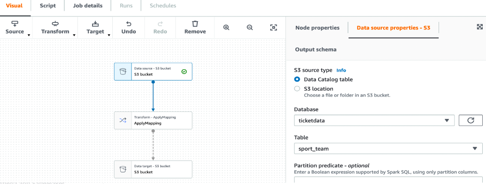
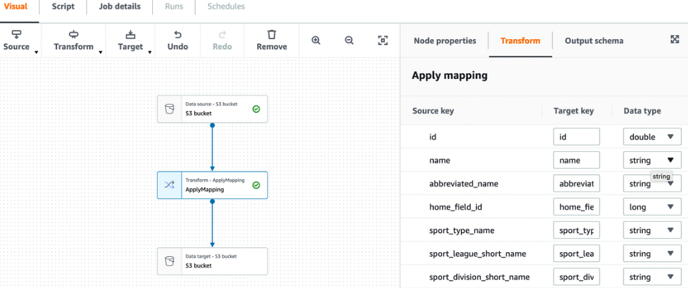
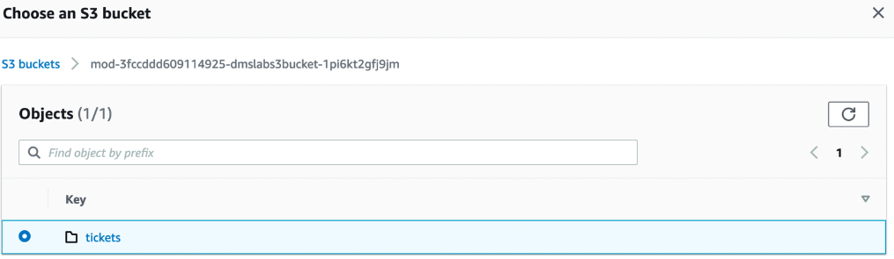
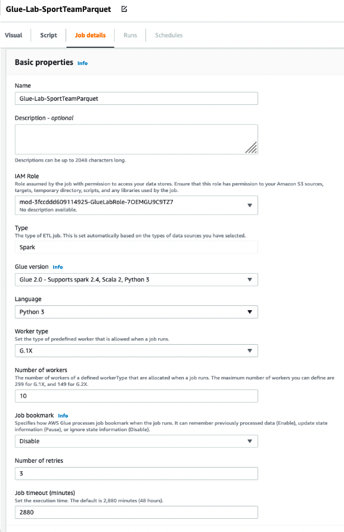
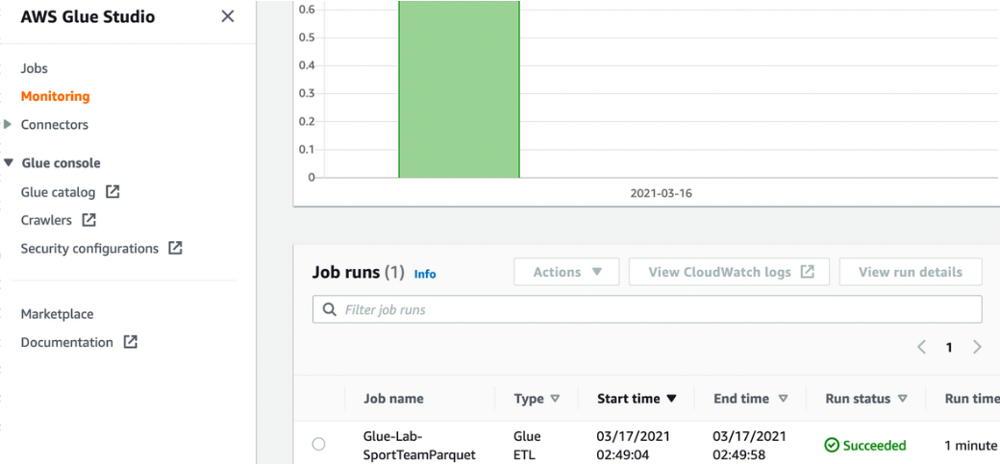

# Lab3-3: Data ETL Exercise

## PART A: Data Validation and ETL - Data ETL Exercise 
사전 조건: 처리된 데이터를 **parquet format**으로 저장하려면 각 테이블에 대한 새 폴더 위치가 필요합니다.\
예를들어 **sport_team** 테이블의 전체 경로는 다음과 같습니다.\
*`s3://<s3_bucket_name>/tickets/dms_parquet/sport_team`*

Glue는 위의 예와 같이 전체 파일 경로의 입력을 기반으로 새 폴더를 자동으로 생성합니다.\
S3 버킷에 수동으로 폴더를 생성하는 방법은 [사용 설명서](https://docs.aws.amazon.com/AmazonS3/latest/user-guide/create-folder.html)를 참조해보세요.

#### 1.왼쪽 탐색 창의 *ETL 메뉴* 에서 *AWS Glue Studio*를 클릭합니다.

#### 2. *View jobs* 을 선택해주세요.

#### 3. *Visual with a source and target* 옵션을 선택하고 *Create* 를 클릭합니다.

#### 4. 좌측 표출되는 그래프 상단에서 *Data source - S3 bucket*을 선택합니다.

#### 5. 그리고 우측 *Data source properties - S3* 패널의 Database 선택메뉴를 드롭다운하여 *`ticketdata`* 선택합니다.

#### 6. 그리고 *`sport_team`* 테이블을 선택합니다.

#### 7. 이번엔 좌측 그래프 중앙에 있는 *ApplyMapping* 노드를 선택합니다. 그리고 우측 *Transform* 패널에서 Source Key의 *id* 열의 *`Data type`*을 double로 변경합니다.

#### 8. 그래프 하단에 있는 *Data target - S3 bucket* 노드를 선택합니다. 그리고 우측 *Data target properites - S3* 패널에서 Format을 드롭다운하여 type을 Parquet으로 변경합니다. 이어서 아래의 *Compression Type*을 드롭다운 하여 Uncompressed 를 선택합니다.
#### 9. *S3 Target Location*에서 *Browse S3*를 선택하고 *`mod-xxx-dmslabs3bucket-xxx`* 버킷을 찾아 tickets 폴더를 선택하고 Choose 를 눌러주세요.

#### 10. 앞서 선택된 S3버킷 path가 입력된 곳에서 추가적으로 *`dms_parquet/sport_team/`* 을 S3 URL에 추가합니다. 
경로는 *`s3://mod-xxx-dmslabs3bucket-xxx/tickets/dms_parquet/sport_team/`* 형태와 유사해야 합니다. Path의 끝부분에 `/`를 잊지 마세요.

#### 11. 마지막으로 좌측 상단의 메인 탭에서 3번째 *Job details* 를 선택합니다. Name에는 *`Glue-Lab-SportTeamParquet`* 을 입력합니다.
#### 12. *IAM Role* 은 *`mod-xxx-GlueLabRole-xxx`* 와 유사한 이름의 역할을 선택합니다.
#### 13. 페이지를 아래로 스크롤해서 *Job bookmark*를 드롭다운하여 *Disable* 선택합니다. 이 Lab의 뒷부분에서 *Job bookmark* 기능을 사용해 볼 수 있습니다.

#### 14. 오른쪽 상단 모서리에 있는 *Save* 버튼을 눌러 Job을 생성합니다.
#### 15. 배너에 *Successfully created job* 메시지가 표시되면 *Run* 버튼을 클릭하여 *Job* 을 시작합니다.
#### 16. 왼쪽 탐색 패널에서 *Jobs* 선택하여 *Job* 목록을 확인합니다.
#### 17. 실행 중인 jobs, success/failure rates 및 기타 다양한 statistics를 보려면 왼쪽 탐색 패널에서 *Monitoring* 선택합니다.

#### 18. *Job runs* 목록을 아래로 스크롤하여 ETL Job이 성공적으로 완료되었는지 확인합니다. 완료하는 데는 약 1분이 소요됩니다.

#### 14. 오른쪽 상단 모서리에 있는 *Save* 버튼을 눌러 Job을 생성합니다.

#### 14. 오른쪽 상단 모서리에 있는 *Save* 버튼을 눌러 Job을 생성합니다.

#### 14. 오른쪽 상단 모서리에 있는 *Save* 버튼을 눌러 Job을 생성합니다.

#### 14. 오른쪽 상단 모서리에 있는 *Save* 버튼을 눌러 Job을 생성합니다.

이렇게 해서 간단히 *Data Validation Exercise* 하는 법을 수행해 봤습니다. 
이제 아래를 클릭하시어, Glue의 주요 기능인 ETL Job을 생성해 보기 위한 Lab으로 이동합니다.  
[3-3.Data Validation and ETL - Data ETL Exercise](../detail/3-3.DataETLExercise.md)
