# Lab3-4: Create Glue Crawler for Parquet Files

## PART A: Data Validation and ETL - Create Glue Crawler for Parquet Files 

이번 단계에서는 아래 Architecture에서 **⓹번,⓺번**에 해당되는 Glue의 마지막 작업을 실습해 봅니다.\
이 실습을 통해 앞서 변경한 Parquet파일을 *Crawlering*하여 *Data Catalog*를 생성하고 Database와 Table들을 Amazon Athena에서 활용할 수 있습니다.\
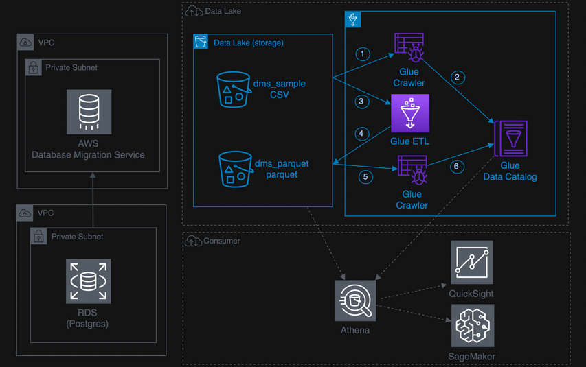</img> 

#### 1.Glue Studio 탐색 메뉴에서 *Crawlers* 선택하여 새 탭에서 Glue Crawlers 페이지를 열고 *Add crawler*를 클릭합니다.
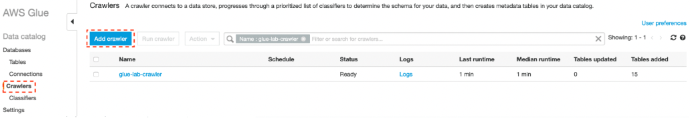

#### 2. *Crawler name*에 `glue-lab-parquet-crawler` 를 입력하고 *Next*를 클릭합니다.
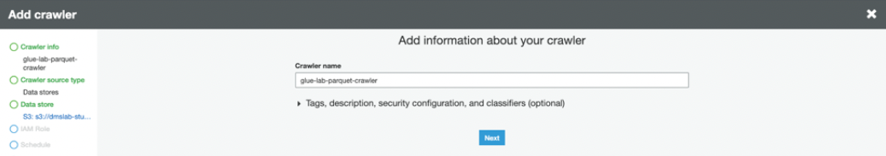

#### 3. 다음 화면 *Specify crawler source type*에서 *for Crawler source type*으로 *Data Stores*를 선택하고 *Next*을 클릭합니다.

#### 4. data store 추가 화면에서
	a. Choose a data store에서 S3를 선택!
	b. For Crawl data in, select “Specified path in my account”.
	c. Include path에는 parquet 파일이 포함된 S3의 경로를 지정(상위 Parquet 폴더), (ex> s3://xxx-dmslabs3bucket-xxx/tickets/dms_parquet).
 	d. Next 클릭!
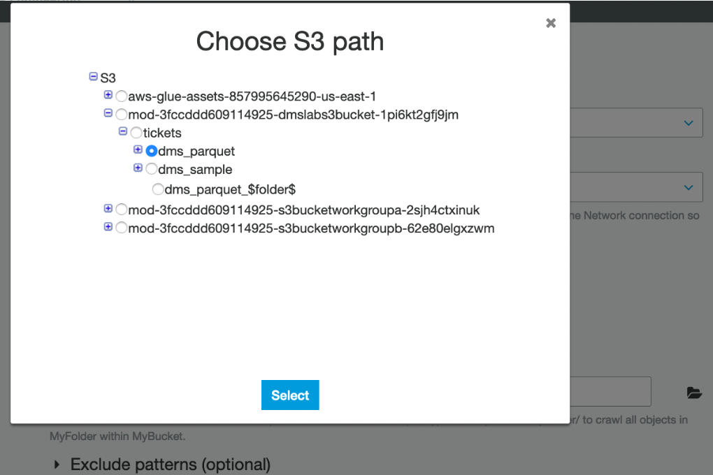</img> 
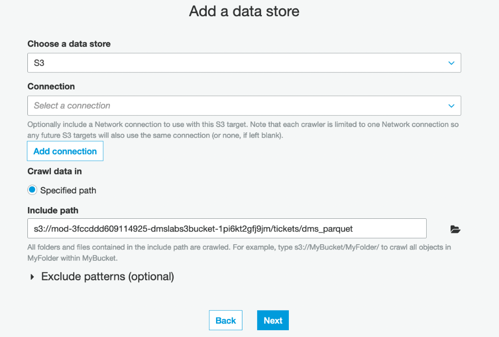</img> 

#### 5. Add another data store를 묻는 화면에서 *No*를 선택하고 *Next*를 클릭합니다.
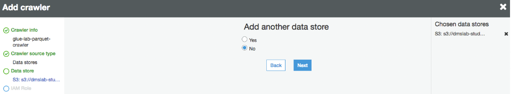

#### 6. IAM Role 선택 페이지에서 *Choose an existing IAM role* 선택합니다.
	a. IAM role은 기존에 생성된 “mod-xxxxx-GlueLabRole-xxxxx” 을 선택 후 Next 클릭!
</img> 

#### 7. Frequency 대해 *"Run On Demand"* 을 선택하고 *Next*를 클릭합니다.
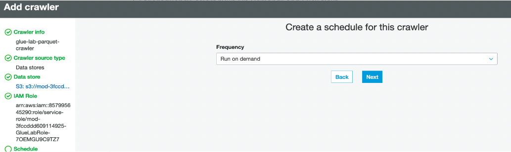</img> 

#### 8. crawler’s output database의 경우 이전에 생성한 기존 데이터베이스를 선택합니다. e.g. *ticketdata*
#### 9. Prefix added to tables에 `parquet_`를 입력합니다.
</img> 

#### 10. summary 페이지를 검토하고 *Finish* 를 클릭합니다.
#### 11. *Run Crawler*을 클릭합니다. Crawler실행이 완료되면 실습 [3-3.Data Validation and ETL - Data ETL Exercise](../detail/3-3.DataETLExercise.md)에서 설정한 parquet ETL 변환 갯수에 따라 테이블이 1~5개 까지 추가 되었음을 확인 할 수 있습니다.
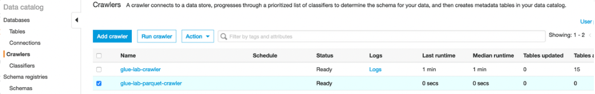

### 👏👏👏수고하셨습니다. 이제 3-x.Glue를 활용한 실습을 모두 완료 했습니다.
### 마지막으로 다음 검증 작업을 통해 우리가 *Glue Crawler*로 작업한 *parquet table*들이 올바르게 생성되었는지 확인해 봅니다. 이 데이터는 [4.Lab: Query and Visualize](./detail/4.Lab:QueryNVisualize.md)실습에서 활용 됩니다.

왼쪽 탐색 창에서 *Databases > Tables* 클릭하여, 검색창에 다음과 같은 Filter를 사용하여 지금 새로만든 parquet Table들을 확인해 봅니다. 
검색창: `Database = ticketdata`, `Classification = parquet`
아래와 같이 앞 단계에서 생성한 5 개의 *"parquet_xxx"* table목록을 확인!.
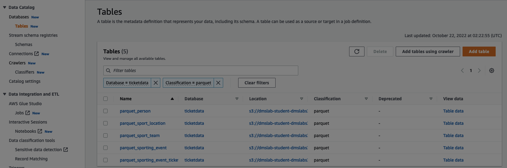

<Optional> 이어서 5개의 parquet table들의 각 column data type이 맞게 변환되었는지 확인하기 위해서 table목록 우측의 **View data** 항목의 *Table data*를 클릭하면 **Athena Query**를 통해 바로 table속성과 데이터를 query한 결과를 볼수 있습니다.
각 테이블의 **View data** 항목의 **Table data**를 클릭하고 **view** 창에서 *proceed* 버튼을 클릭합니다. 
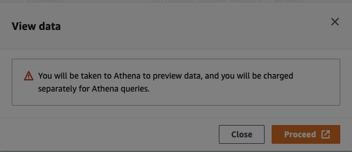

예시와 같이 parquet_person의 실제 데이터 쿼리에 대한 결과를 확인할 수 있으며 핸즈온 가이드에서 변환해야하는 컬럼 속성들이 맞게 변환되었는지 비교해야 합니다. 
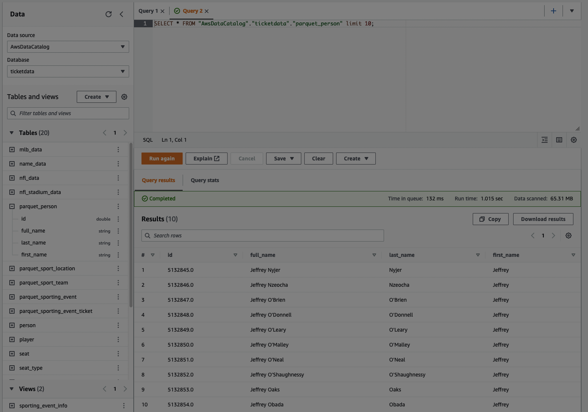</img> 
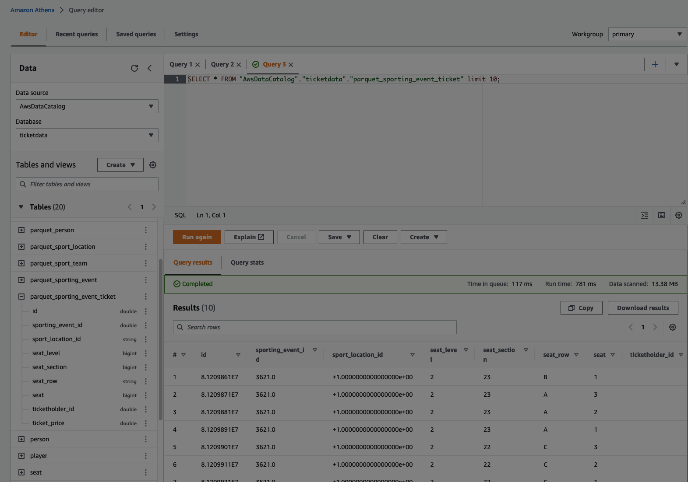</img> 
  
만약 속성들이 맞게 변환되지 않은 경우 *Glue Studio > Job* 에서 앞서 생성한 job을 삭제하고 재 생성하거나 *잘못 생성 된 Job선택(체크박스) > Action > Edit Job*을 통해 속성을 맞게 변환 후 Job을 저장하세요. 그리고 반드시 **Run** 을 다시 시작해주세요.
*****  
### 데이터 확인이 완료 되었다면 [4.Lab: Query and Visualize](./detail/4.Lab:QueryNVisualize.md)
