# Lab3-1: Create Glue Crawler for initial full load data

PART A: Data Validation and ETL - Create Glue Crawler for initial full load data


초기에 Amazon DMS를 통해 Amazon S3 버킷으로 full load 되는 CSV데이터를 _Data Catalog_로 만들기 위해 Glue Crawler를 생성해 봅니다.
이번 실습은 아래 Architecture에서 **⓵번,⓶번**에 해당되는 단계이며, 이 단계를 완료하면 Amazon S3 버킷을 데이터 원본으로 사용하여 Glue Crawler로 Data Catalog 의 Database와 Table을 생성할 수 있습니다.


#### 1. 먼저 [**AWS Glue**](https://console.aws.amazon.com/glue/home) 로 이동합니다.


#### 2. AWS Glue menu에서 Crawlers를 선택하세요.

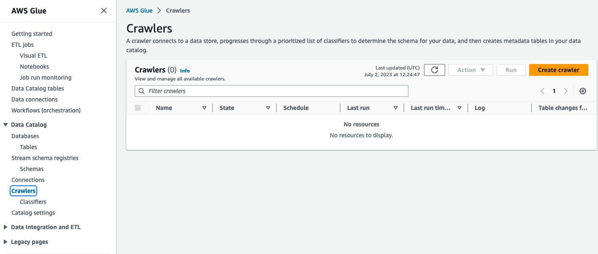

#### 3. Add crawler 클릭해서 crawler 이름을 다음 `glue-lab-crawler` 로 입력해 주세요.

#### 4. 필요한 경우 description을 입력하시고 Next를 클릭합니다.

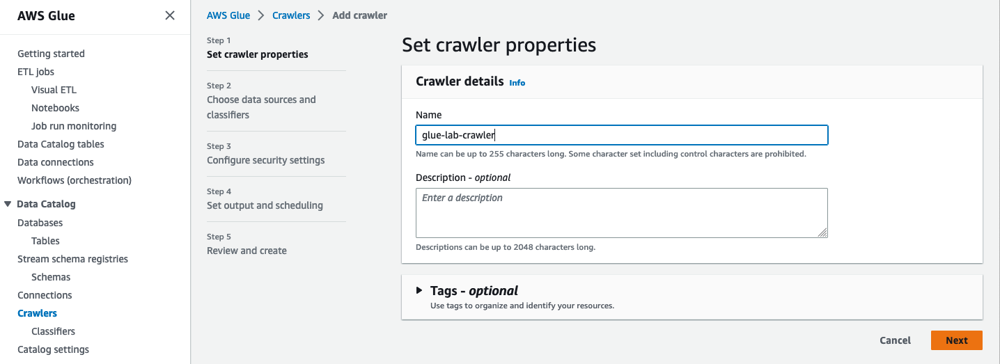

#### 5. Step 2에서 **Choose data sources and classifiers를 작성해 봅니다.**
메뉴에서 Add data source를 클릭!

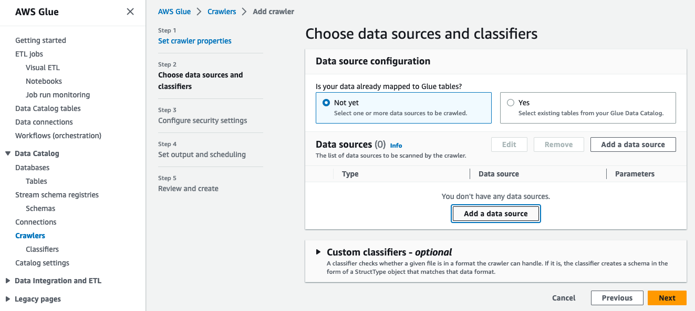

DMS 실습때 가져온 S3 Bucket을 Browse에서 찾아서 선택합니다. 이때 S3 Bucket 내에 _tickets_ 까지 선택합니다.

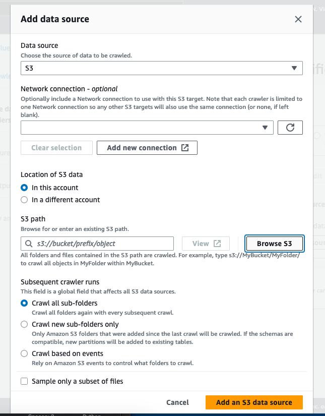
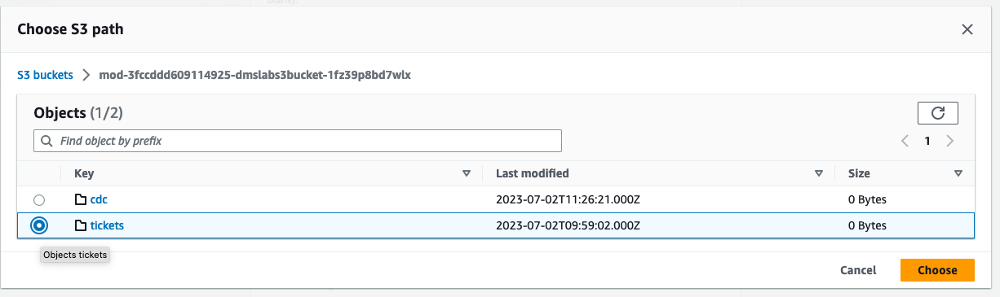

S3 Path에 선택된 S3 Bucket 경로를 확인하고 그대로 Add an S3 data source 버튼을 클릭!

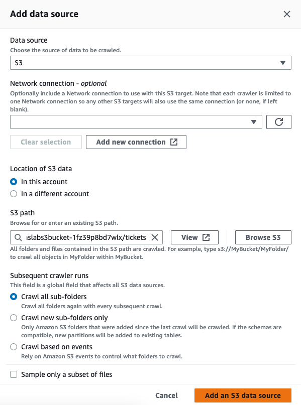

본 페이지에서 **Choose data sources and classifiers**를 확인하고 Next 버튼을 클릭!

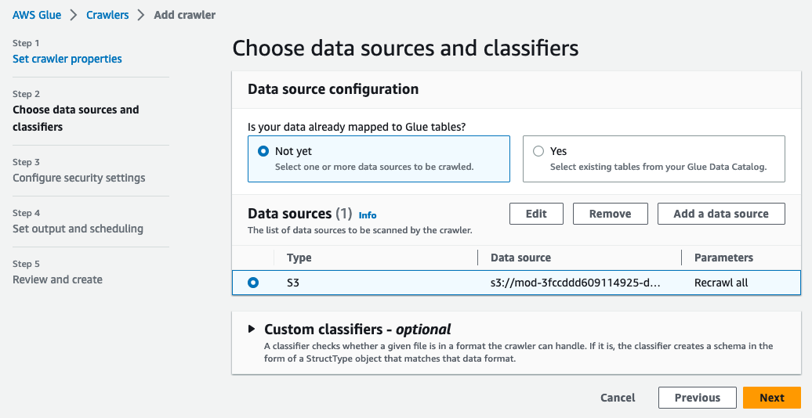

#### 6. Step 3 **Configure security settings** 페이지에서 IAM 설정을 아래와 같이 수행합니다.
**IAM role > Existing IAM role** 메뉴에서 Cloudformation에 의해 자동 생성된 _mod-xxxx-GlueLabRole-xxxx_을 선택

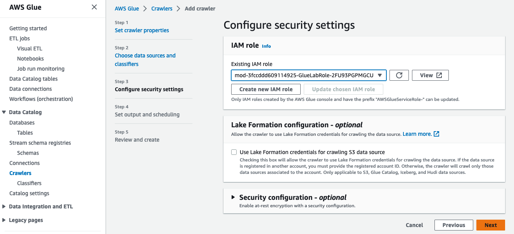

#### 7. Step 4 **Set output and scheduling** 페이지에서, Target database를 생성하고 **Crawler schedule** 을 설정합니다.
_Add database_ 를 클릭해서 새 창에서 Glue Catalogue 대한 새 데이터베이스를 생성해 봅니다.
메뉴에서 데이터베이스 이름: ```ticketdata```로 지정하고 Create database 클릭!

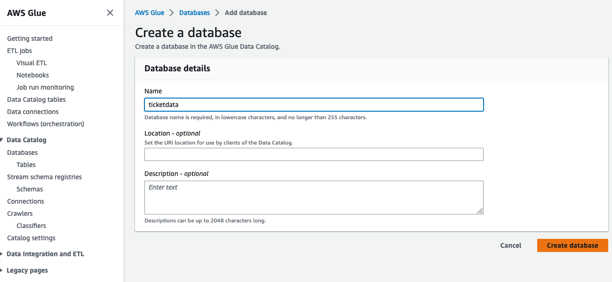

페이지에서 ticketdata 라는 이름의 데이터베이스가 생성된 것을 확인하고, 이전 창(Set output and scheduling 메뉴)로 복귀합니다.
- Target database를 새로고침하고 이전에 생성한 ticketdata를 찾아서 선택!
- 아래에 Crawler schedule의 Frequency는 On demand를 유지한채 Next 클릭!
- 
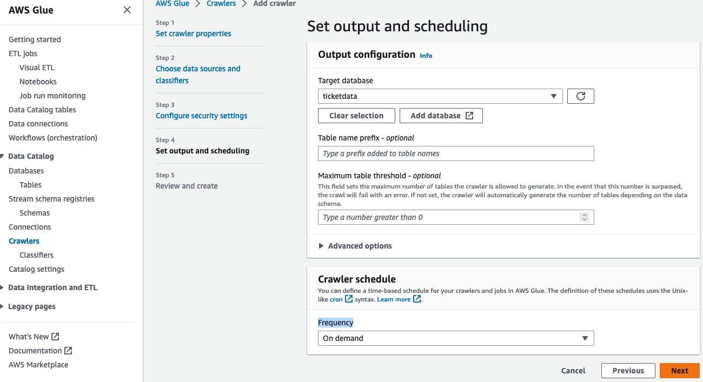

#### 8. Step 5 **Review and create** 에서 지금까지 설정한 내용에 대해 검토 후 Create crawler를 클릭! 이제 crawler를 실행할 준비가 되었습니다.

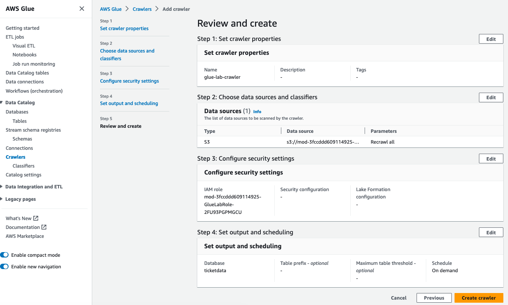

#### 9. 방금 생성한 crawler(glue-lab-crawler)를 체크하고 _Run_ 버튼을 클릭합니다.

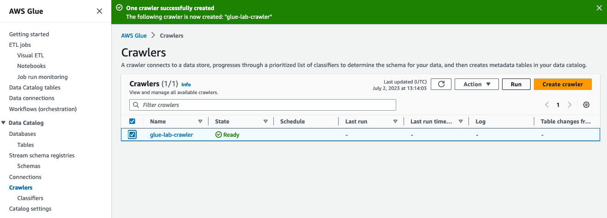 

crawler 상태가 Start → Stop 으로 변경되고 crawler 다시 Ready 상태로 돌아올 때까지 기다리면(이 프로세스는 몇 분 정도 소요됨) 15개의 테이블이 생성되었음을 알 수 있습니다. 

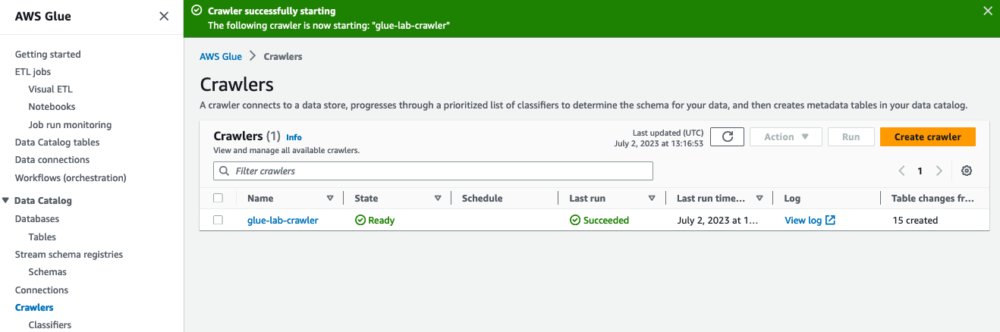 

#### 10. AWS Glue 좌측의 탐색창에서, _Databases → Tables_ 선택하고. 또한 _ticketdata_ 데이터베이스를 클릭해서 테이블을 확인할 수 있습니다.

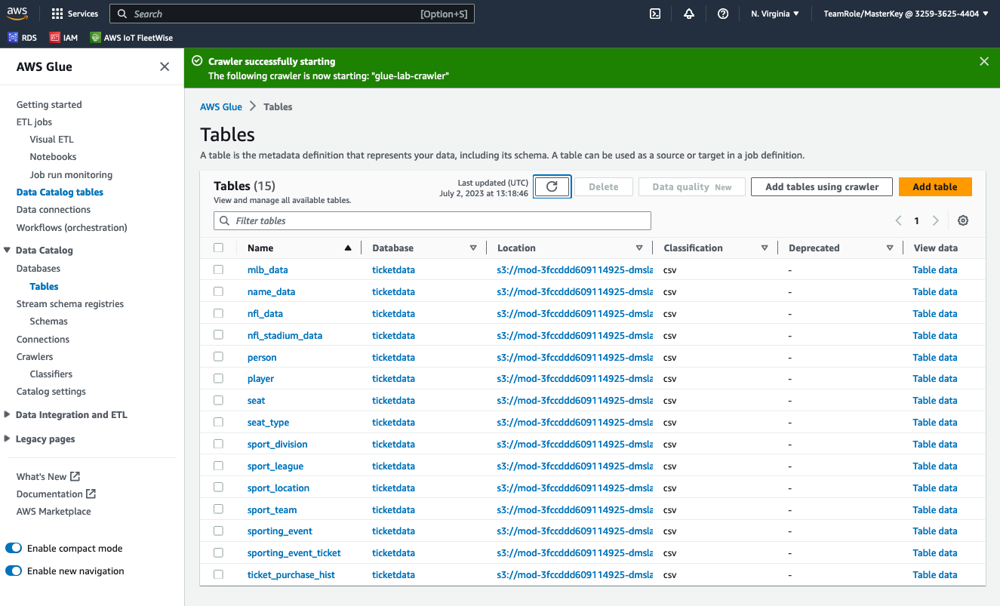 

여기까지 _Create Glue Crawler for initial full load data_ 을 완료하셨습니다.\
이제 아래를 클릭하시어, Glue 를 통해 Crawlering 해온 데이터를 검증해보기 위한 Lab으로 이동합니다.\
\
[3-2.Data Validation and ETL - Data Validation Exercise](3-2.datavalidationexercise.md)
