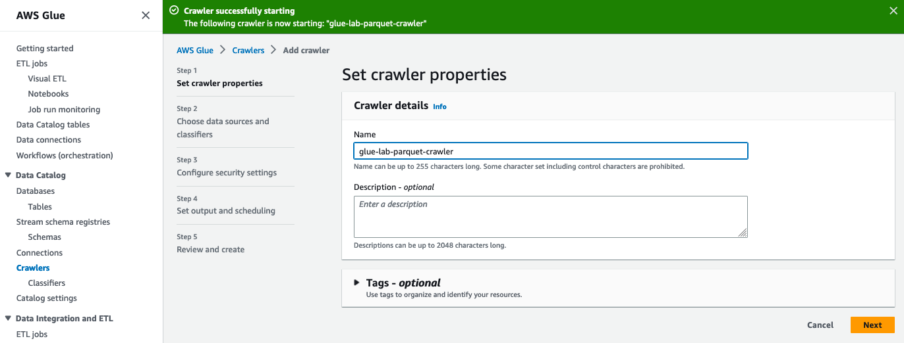
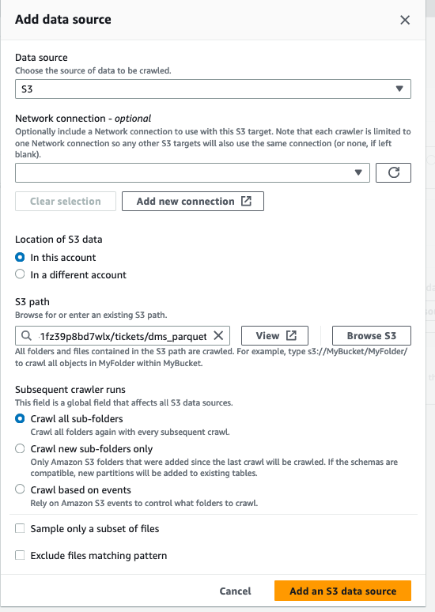
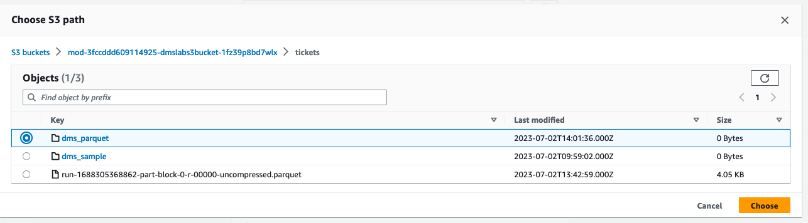
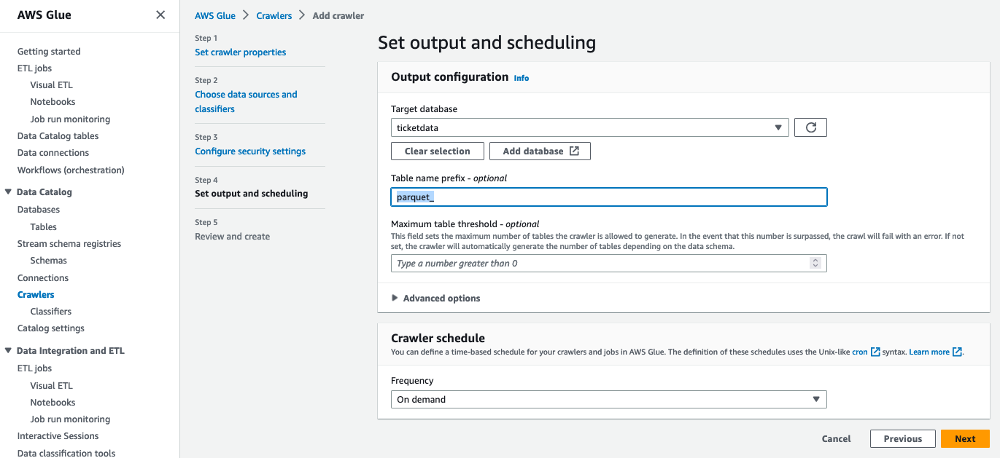
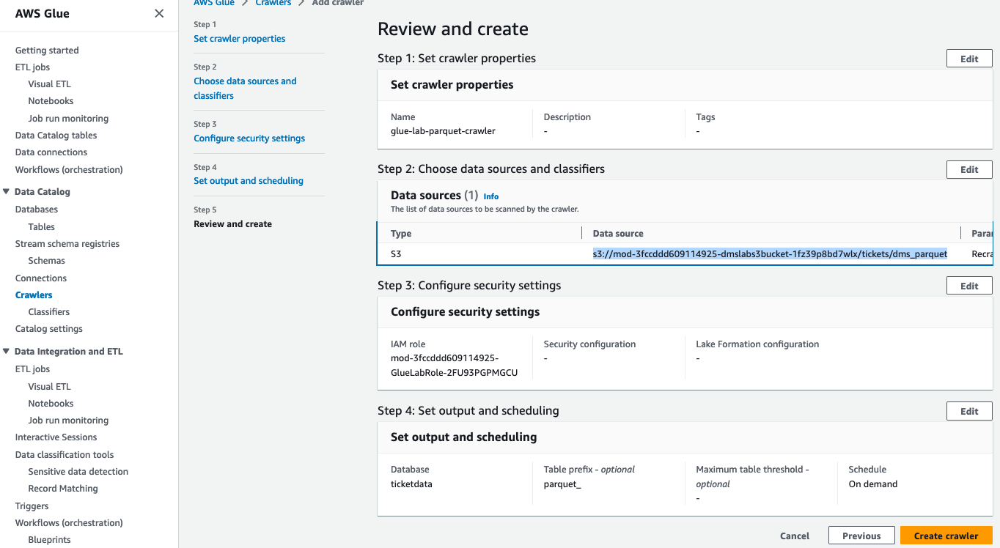
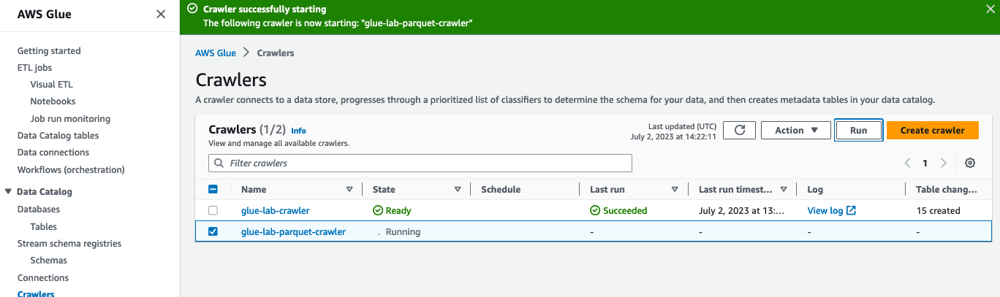
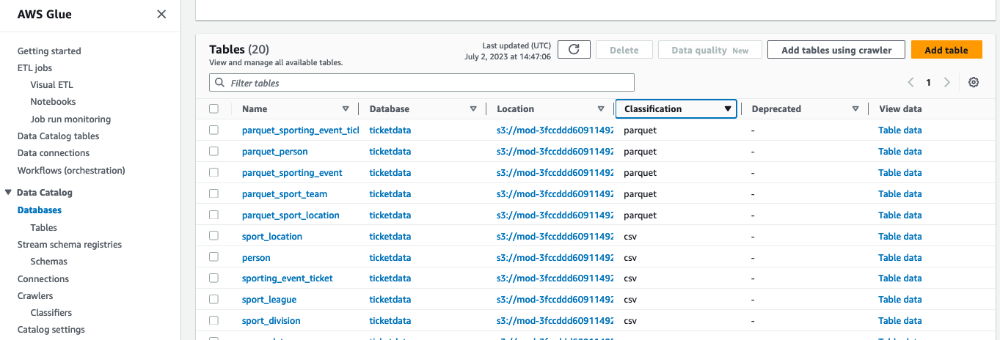

# Lab3-4: Create Glue Crawler for Parquet Files

PART A: Data Validation and ETL - Create Glue Crawler for Parquet Files


이번 단계에서는 아래 Architecture에서 **⓹번,⓺번**에 해당되는 Glue의 마지막 작업을 실습해 봅니다.\
이 실습을 통해 앞서 변경한 Parquet파일을 *Crawlering*하여 *Data Catalog*를 생성하고 Database와 Table들을 Amazon Athena에서 활용할 수 있습니다.


#### 1. AWS Glue menu에서 Crawlers를 선택하세요.


#### 2. Create crawler 클릭해서 crawler 이름을 다음 `glue-lab-parquet-crawler` 로 입력해 주세요.

#### 3. 필요한 경우 description을 입력하시고 Next를 클릭합니다.



#### 4. Step 2에서 **Choose data sources and classifiers를 작성해 봅니다.**
메뉴에서 Add data source를 클릭!


ETL Job 실습때 생성한 S3 Bucket Folder를 Browse에서 찾아서 선택합니다. parquet 파일이 포함된 S3의 경로를 지정(상위 Parquet 폴더), (ex> s3://xxx-dmslabs3bucket-xxx/tickets/dms_parquet).





S3 Path에 선택된 S3 Bucket 경로를 확인하고 그대로 Add an S3 data source 버튼을 클릭!

본 페이지에서 **Choose data sources and classifiers**를 확인하고 Next 버튼을 클릭!


#### 6. Step 3 **Configure security settings** 페이지에서 IAM 설정을 아래와 같이 수행합니다.
**IAM role > Existing IAM role** 메뉴에서 Cloudformation에 의해 자동 생성된 _mod-xxxx-GlueLabRole-xxxx_을 선택


#### 7. Step 4 **Set output and scheduling** 페이지에서, Target database는 이전에 생성한  ```ticketdata``` 로 지정하고 *Table name prefix - optional* 에는 ```parquet_``` 를 입력해 줍니다.
- 이전에 생성한 ticketdata를 찾아서 선택!
- 아래에 Crawler schedule의 Frequency는 On demand를 유지한채 Next 클릭!



#### 8. Step 5 **Review and create** 에서 지금까지 설정한 내용에 대해 검토 후 Create crawler를 클릭! 이제 crawler를 실행할 준비가 되었습니다.



#### 9. 방금 생성한 crawler(glue-lab-parquet-crawler)를 체크하고 _Run_ 버튼을 클릭합니다.

 

crawler 상태가 Start → Stop 으로 변경되고 crawler 다시 Ready 상태로 돌아올 때까지 기다리면(이 프로세스는 몇 분 정도 소요됨) 5개의 테이블이 생성되었음을 알 수 있습니다. 


#### 10. AWS Glue 좌측의 탐색창에서, _Databases → Tables_ 선택하고. 또한 _ticketdata_ 데이터베이스를 클릭해서 _parquet_테이블이 5개 추가되어 있음을 확인할 수 있습니다.

 

### 👏👏👏수고하셨습니다. 이제 3-x.Glue를 활용한 실습을 모두 완료 했습니다.

### 마지막으로 다음 검증 작업을 통해 우리가 _Glue Crawler_로 작업한 _parquet table_들이 올바르게 생성되었는지 확인해 봅니다. 이 데이터는 [4.Lab: Query and Visualize](../4.lab-querynvisualize/)실습에서 활용 됩니다.

왼쪽 탐색 창에서 _Databases > Tables_ 클릭하여, 검색창에 다음과 같은 Filter를 사용하여 지금 새로만든 parquet Table들을 확인해 봅니다.\
검색창: `Database = ticketdata`, `Classification = parquet` 아래와 같이 앞 단계에서 생성한 5 개의 _"parquet\_xxx"_ table목록을 확인!. 


이어서 5개의 parquet table들의 각 column data type이 맞게 변환되었는지 확인하기 위해서 table목록 우측의 **View data** 항목의 _Table data_를 클릭하면 **Athena Query**를 통해 바로 table속성과 데이터를 query한 결과를 볼수 있습니다. 각 테이블의 **View data** 항목의 **Table data**를 클릭하고 **view** 창에서 _proceed_ 버튼을 클릭합니다.


parquet\_person의 실제 데이터 쿼리에 대한 결과를 확인할 수 있으며 핸즈온 가이드에서 변환해야하는 컬럼 속성들이 맞게 변환되었는지 비교해야 합니다.\
중요> 이 때 Athena를 통해 수행되는 쿼리를 저장할 S3 위치를 추가해 줍니다. 


만약 속성들이 맞게 변환되지 않은 경우 _Glue Studio > Job_ 에서 앞서 생성한 job을 삭제하고 재 생성하거나 _잘못 생성 된 Job선택(체크박스) > Action > Edit Job_을 통해 속성을 맞게 변환 후 Job을 저장하세요.\
그리고 반드시 **Run** 을 다시 시작해주세요.

***

### 데이터 확인이 완료 되었다면 [4.Lab: Query and Visualize](../4.lab-querynvisualize/)
