# Lab: QuickSight 기능 둘러보기

## QuickSight 차트 생성
이 섹션에서 여러 타입의 차트를 만들어 보겠습니다
#### 1. <em>Fields list</em>에서 <em>ticket_price</em> 컬럼을 클릭
#### 2. <em>ticket_price</em>필드의 expand icon을 클릭하고, 숫자를 달러값으로 표시하기 위해 <em>Show as Currency</em> 선택

#### 3. 화면 왼쪽 상단에 있는 <em>Add </em>을 클릭 후, add visual 할 수 있습니다.
- Data set 아래 <b>Visual types</b> 에서 <b>Vertical bar chart</b> 아이콘 선택
- 이 레이아웃은 X-axis 값이 필요합니다. <b>Fields list</b>에서, <b>event_date_time</b>를 선택하면 그래프가 업데이트됩니다.
- Y-axis로 Fields list에서 <b>ticket_price</b> 선택

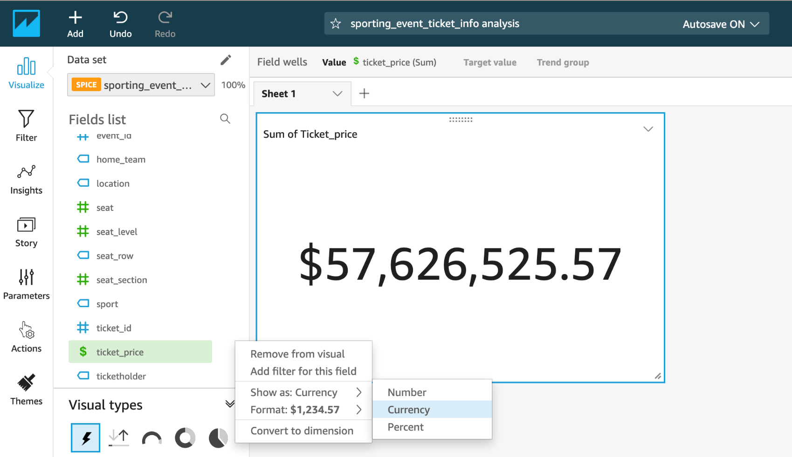
<br></br>
#### 4. 대시보드에 필드를 드래그해 가져올 수도 있습니다. Field list에서 <em>seat_level</em>을 클릭하고 <em>Group/Color</em>박스로 드래그하세요.
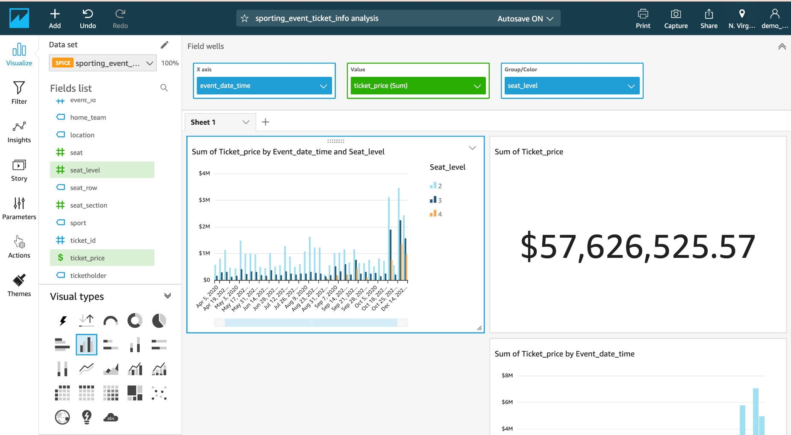
<br></br>
차트 타입을 바꿔봅시다

#### 5. Visual types에서 <em>Clustered bar combo chart</em> 선택
#### 6. Field list에서 <em>ticketholder</em>필드를 <em>Lines</em>박스로 드래그
#### 7. <em>Lines</em>박스에서, 드롭다운박스 클릭해 Aggregate을 위해 <em>Aggregate: Count Distinc</em>선택. 오른쪽에서 y-axis에 업데이트를 확인할 수 있습니다.
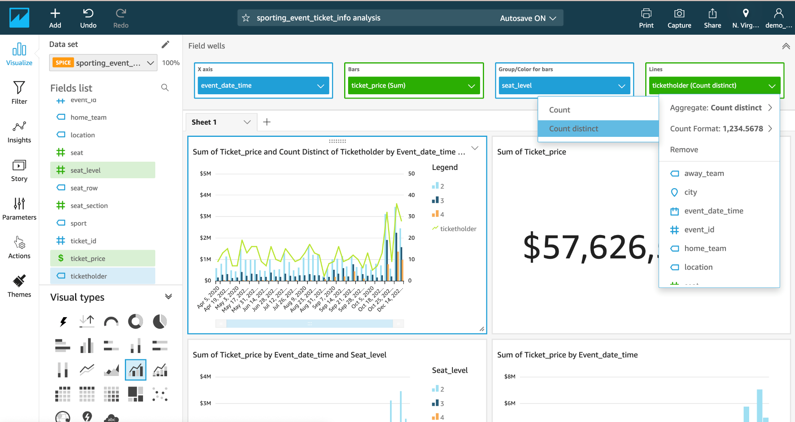
#### 8. 왼쪽 탭 섹션에서 <em>insight</em>아이콘을 클릭해 간단한 인사이트 정보를 확인해볼 수 있습니다
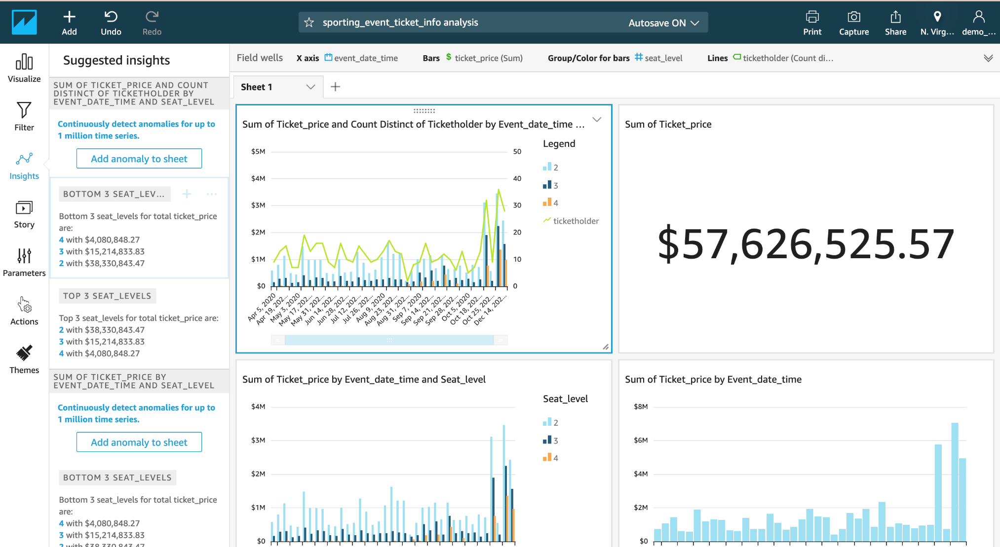<br></br>

### 다양한 차트 타입과 필드로 차트를 테스트해보세요!!
<br></br>
## QuickSight Parameters 생성
이 섹션에서는 대시보드값을 조정할 수 있는 파라미터들을 생성하고 filter에 할당해 보겠습니다

#### 1. 왼쪽 네비게이션 메뉴들에서, Parameters 선택
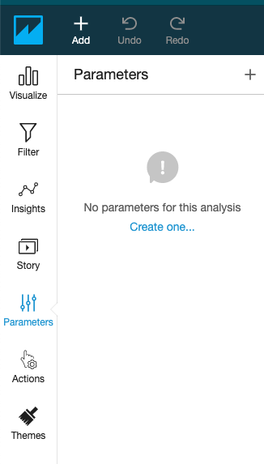
#### 2. 새로운 파라미터 생성을 위해 <em>Create one</em> 선택
#### 3. Name에 <em>EventForm</em> 입력
#### 4. Data type에 <em>Datetime</em> 선택
#### 5. Time granularity에 <em>Hourly</em> 선택
#### 6. Default value로 <em>event_date_time</em>의 범위에서 시작 날짜로 가능한 날짜 선택. 예) 2021-01-01 00:00
#### 7. <em>Create</em> 클릭
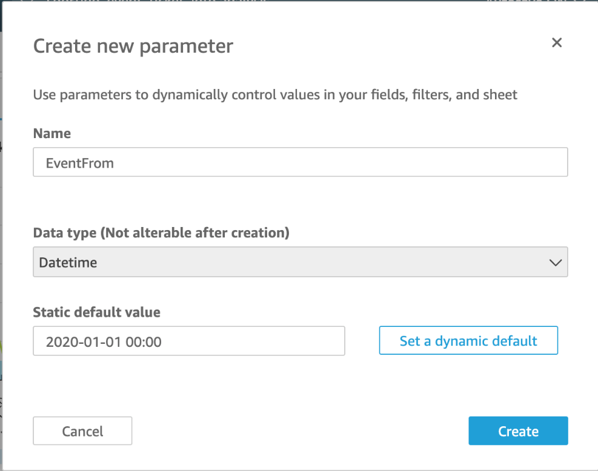<br></br>
#### 8. 아래 속성들로 파라미터를 하나 더 생성
##### - Name: EventTo
##### - Data type: Datetime
##### - Time granularity, Hourly
##### - Default value로 <em>event_date_time</em>의 범위에서 종료 날짜로 가능한 날짜 선택. 예) 20222-01-01 00:00
##### - Create 클릭
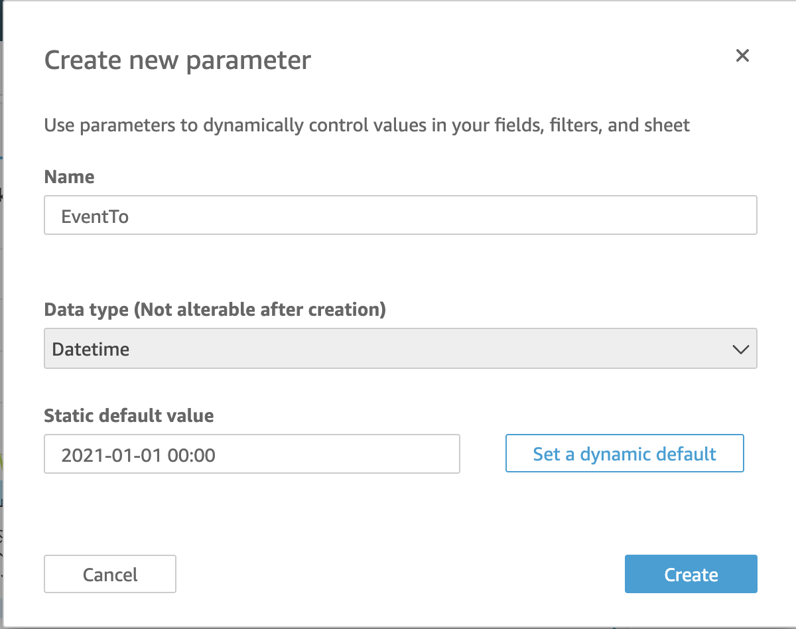<br></br>
#### 9. 다른 방법으로 <em>EventFrom</em> 파라미터에서 <em>Add control</em> 선택할 수도 있습니다.
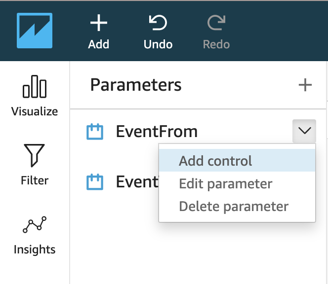<br></br>
#### 10. Display name으로 Event From을 입력하고 Add 클릭
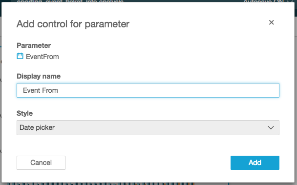<br></br>
#### 11. EventTo로 같은 작업을 반복하고 Display name은 <em>Event To</em> 입력
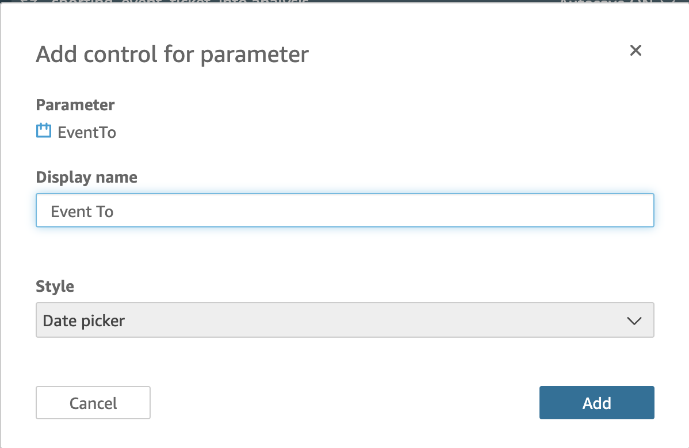
<br></br>
이제 위 차트에서 지정된 파라미터 조건에 따라 변경된 차트를 확인할 수 있습니다.
<br></br>
<br></br>

## QuickSight Filter 생성
모든 Visual에 filter를 적용해 보겠습니다
#### 1. 왼쪽 네비게이션 메뉴에서 Filter 선택
#### 2. + 아이콘을 선택해 <em>event_date_time</em>필드에 대한 filter 추가
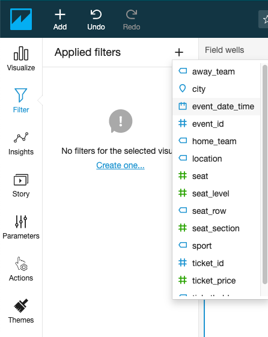<br></br>
#### 3. 속성을 수정하기 위해 filter 선택
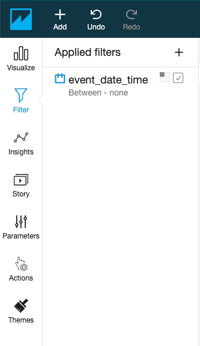<br></br>
#### 4. Filter type으로 <em>Date & Time range</em>rhk <em>Between</em> 선택
#### 5. <em>Use Parameters</em> 옵션 선택 후 <em>Yes</em> 클릭
#### 6. <em>Start date parameter</em>로 <em>EventFrom</em> 선택
#### 7. <em>End date parameter</em>로 <em>EventTo</em> 선택
#### 8. <em>Apply</em> 클릭
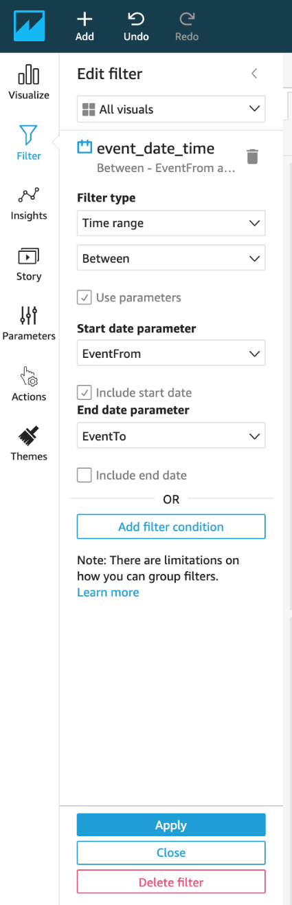<br></br>
<!--
## Calculated Fields 추가
이번 섹션에서 <b>"day of week" "hour of day"</b>를 계산한 필드 값을 dataset에 추가하고 이 두 종속 변수를 새로운 scatter plot에 추가해보겠습니다.

#### 1. 상단 왼쪽에 Add 버튼을 클릭해 <em>Add a calculated field</em> 선택
<br></br>
#### 2. <em>event_day_of_week</em>로 네이밍하기
#### 3. <em>Formula</em>로, extract('WD', {event_date_time}) 입력
```sql
extract()는 데이터값의 일부를 리턴합니다. 시간 정보가 없는 날짜에 시간부분을 요청하면 0을 리턴합니다.
WD: 일주일의 요일을 숫자로 리턴합니다. Sunday는 1.
```
 #### 4. Save 클릭
 <br></br>
 #### 5. 다음 속성들로 다른 계산된 필드 추가
 - Calculated field name : <em>event_hour_of_day</em>
 - Formula: <em>extract('HH',{event_date_time})</em>
```sql
HH: 날짜에서 시간을 리턴합니다
```

#### 6. 상단 왼쪽에 있는 Add 버튼을 클릭해 <em>Add visual</em>선택
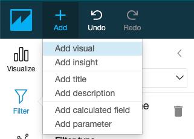<br></br>
#### 7. field type에 <em>scatter plot</em>선택
#### 8. Fields list에서, 그래프 속성으로 다음을 선택하세요
- X-axis: "event_hour_of_day"
- Y-axis: "event_day_of_week"
- Size: "ticket_price"

<br></br>

화면 오른쪽 상단에 Share 메뉴가 있습니다.
대시보드는 다른 Amazon QuickSight 사용자에게 리포팅용으로 공유할 수 있는 read-only 스냅샷 분석창입니다.
이 대시보드에서 다른 사용자들이 visual과 data를 써볼 수 있으나 dataset을 수정할 수는 없습니다.
visual을 함께 만들어보고 싶은 여러 사용자들에게 analysis를 공유할 수 있습니다. analysis는 다른 dataset을 쓰고 수정할 수 있게 합니다.
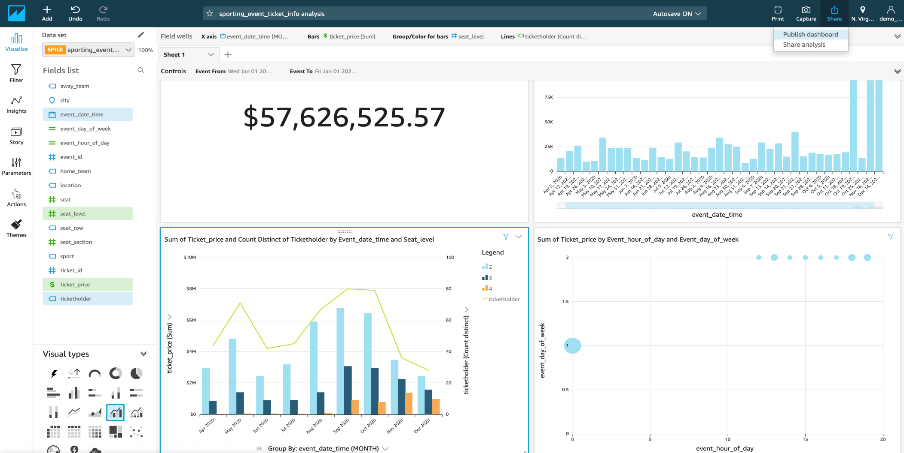<br></br>
-->

Federated Query 기능이 궁금하시다면 다음 실습을 활용해주세요!
[4-4:Federated Query](4-4:AthenaFederatedQuery.md)
