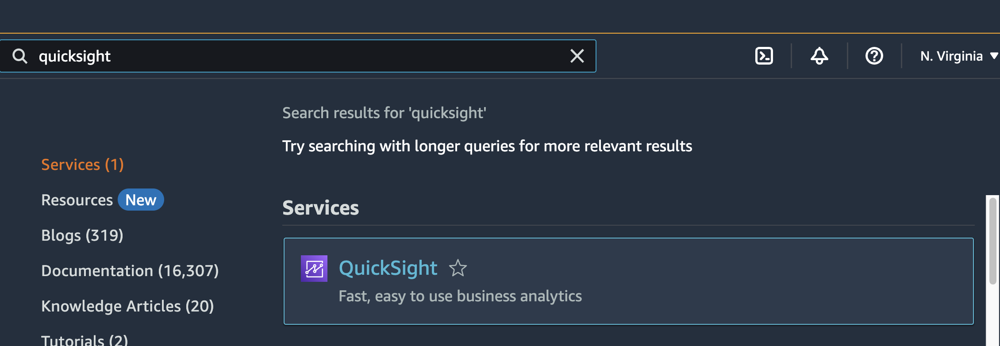
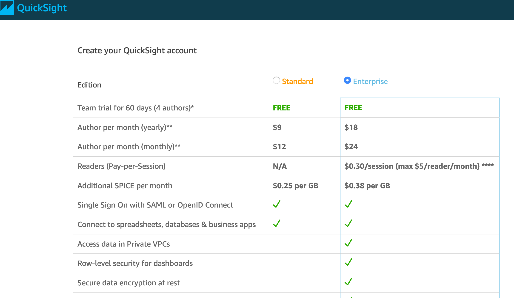
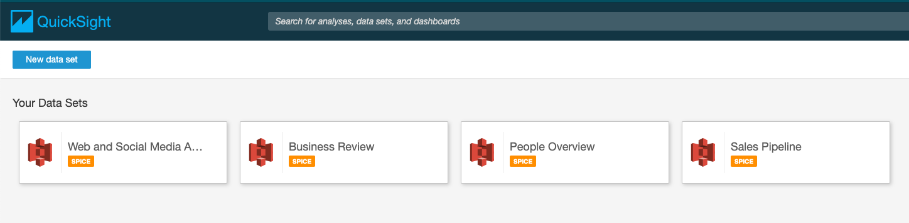
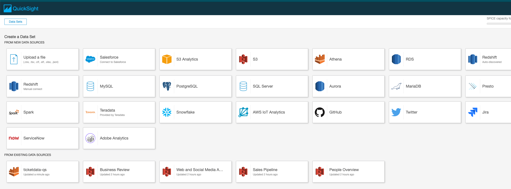
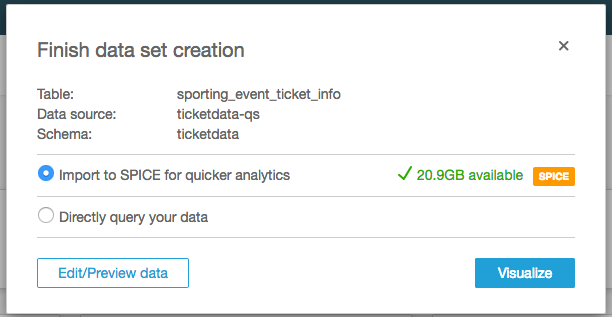
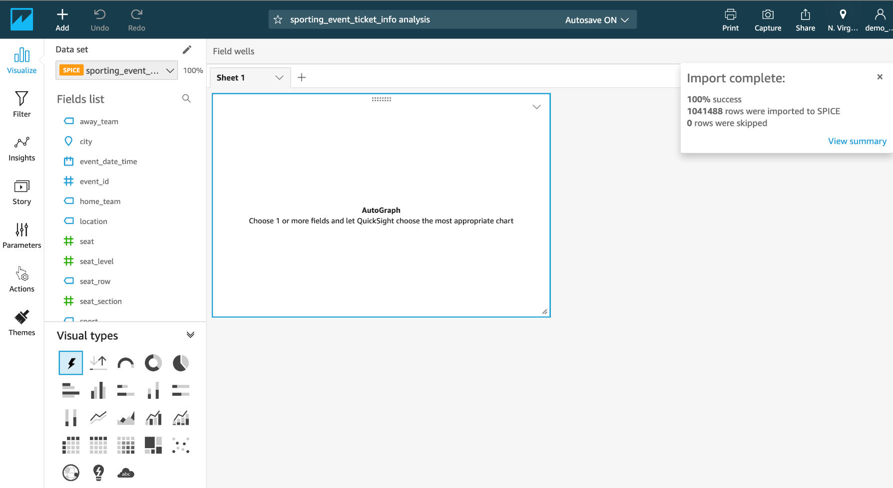

# Lab4-2: QuickSight 대시보드 만들기

## QuickSight 세팅(일부 UI변경되었으니 강사의 설명에 집중해주세요.)

#### 1. AWS 콘솔창에서 QuickSight 검색

QuickSight 사용이 처음이면, 계정 생성 절차가 실행되니 완료해 주십시오.

#### 2. _Sign up for QuickSight_ 클릭  

#### 3. account type은 Enterprise 선택  

#### 4. _Continue_ 선택

#### 5. Create your QuickSight account 페이지에서, QuickSight account name에는 unique한 이름(e.g., quicksight-lab--)과 이메일을 입력해야 합니다.  

#### 6. 사용중인 AWS 리전을 선택하고 auto discovery, Amazon Athena, Amazon S3를 활성화하도록 체크박스 선택  

#### 7. DMS 버킷(e.g., _"xxx-dmslabs3bucket-xxx"_)선택 후 _Finish_ 클릭  

#### 8. 상단 오른쪽에 New analysis 클릭  

#### 9. New Data Set 클릭  

#### 10. Create a Dataset페이지에서 Data source로 Athena 선택  

#### 11. Data source name : ticketdata-qs 입력 후, Validate connection 클릭

#### 12. Create data source 클릭  

#### 13. Database 드롭다운 리스트에서 ticketdata 선택

#### 14. sporting\_event\_ticket\_info 테이블 선택 후, Select 클릭  

#### 15. Import to SPICE for quicker analytics옵션 선택 후 Visualize 클릭

만약 사용 가능한 SPICE 용량이 없다면 Directly query your data 선택

### 드디어 여러분의 대시보드를 만들 수 있는 QuickSight Visualize interface를 확인할 수 있습니다!!!

#### 다음 [4-3:QuickSightFunction](4-3-quicksightfunction.md)에서 QuickSight의 각종 기능 실습을 시작해 봅니다.🤗
