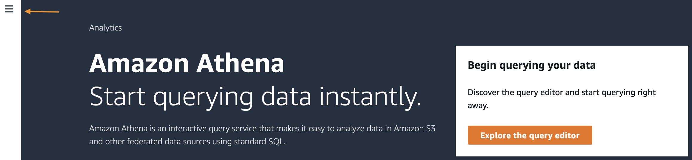
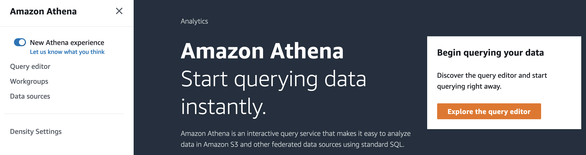
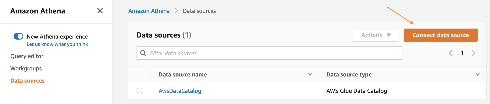
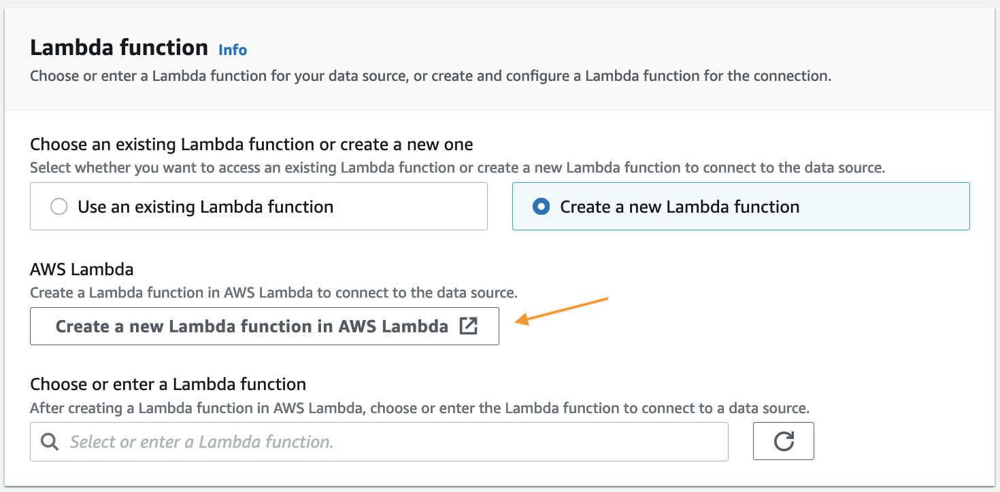
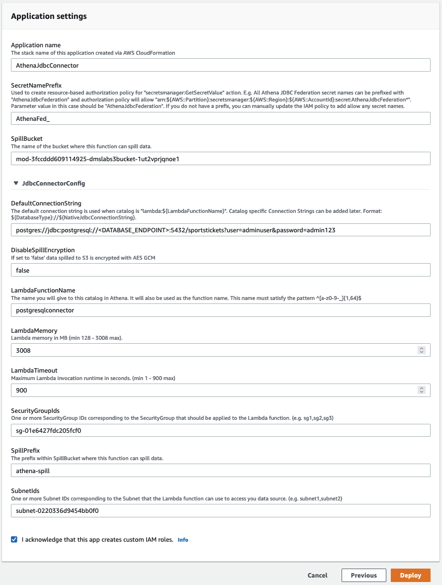
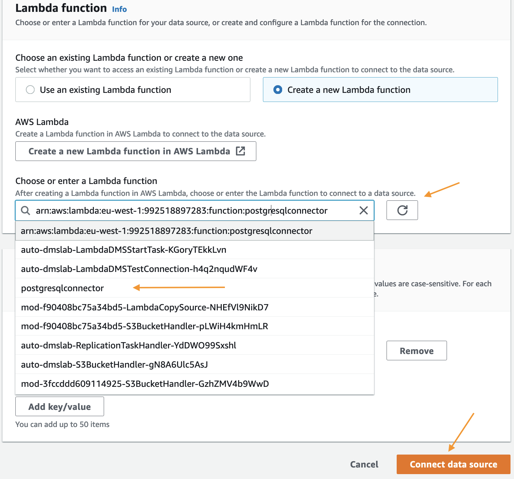
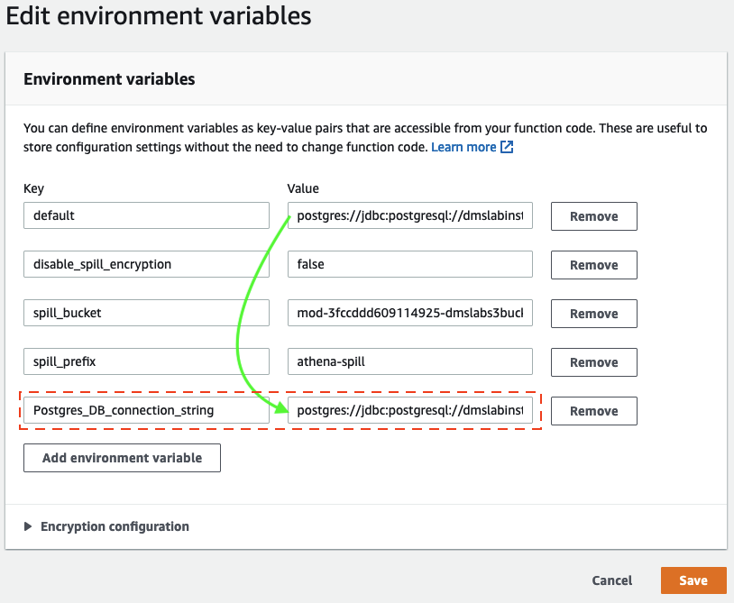

# Lab4-4: Athena Federated Query

## Athena에서 RDS Query 실행해보기

Federated query는 데이터 분석가, 엔지니어, 데이터 사이언티스트들이 관계형, 비관계형, 오브젝트, 커스텀 데이터 소스에 걸쳐 저장되어 있는 데이터에 SQL 쿼리를 실행할 수 있는 기능입니다. Athena Federated query로 고객분들은 하나의 SQL 쿼리를 실행해 온프렘 또는 클라우드에 있는 복수개의 소스들의 데이터를 분석할 수 있습니다. Athena는 AWS Lambda에서 실행되는 Data Source Connector를 사용해 federated query를 실행합니다.

이 랩을 통해 Athena에서 다른 데이터 소스로부터 쿼리하는 방법을 배워볼 것입니다. 초기 셋업에서 생성했었던 기존의 RDS 데이터베이스를 datasource-1으로 쓰고 (S3에 있는)데이터레이크 데이터를 datasource-2로 쓰겠습니다

## 사전 준비사항

_Ingestion with DMS와 Transforming data with Glue ETL 랩을 먼저 해주십시오._\
만약 Event Engine Team Dashboard를 사용중이라면 아래 값들을 확인해주세요.

Security Group Id EC2 Security Group에서 sgdefault문자열로 시작하는 Security Group Name을 확인하세요 (e.g., sg-006190abcdc987654)\
Athena Federated Query Connector를 위한 SubnetId\[Amazon VPC Subnet 콘솔의 Private Subent ID] (e.g., subnet-06dgsdfgddgd4)

## 실습

#### 1. Lambda용 Athena connector에서 S3를 접근할 수 있도록 S3 endpoint를 만든다. S3 endpoint를 만들기 위해 다음 과정을 따라주세요.

다음 단계에서 Lambda로 쓰일 서브넷과 같은 서비스인지 확인하세요. 이는 AWS backbone을 통해 S3에 접근하도록 서브넷 라우팅 테이블의 route entry를 넣을 것입니다.

#### 2. Athena 콘솔에서 상단 왼쪽에 있는 3줄모양 아이콘을 클릭해 내비게이션바를 열고 "Data sources" 클릭





#### 3. Data sources 페이지에서 _Create data source_ 클릭



#### 4. 아래 스크린샷처럼 데이터 소스로 _PostgreSQL_ 선택


#### 5. _Data source datailes_ 아래에 Data source name에 _Postgres\_DB_ 입력


#### 6. _Lambda function_ 아래에 'Create a new function'을 선택하고 _Create a new Lambda function in AWS Lambda botton_을 클릭해 AWS Lambda 콘솔 열기



#### 7. 캡쳐된 사진과 아래 정보를 입력하고 _Deploy_ 클릭

| Field                   | Value                                                                                                                                                                                                                               |
| ----------------------- | ----------------------------------------------------------------------------------------------------------------------------------------------------------------------------------------------------------------------------------- |
| Application Name        | AthenaJdbcConnector                                                                                                                                                                                                                 |
| SecretNamePrefix        | AthenaFed\_                                                                                                                                                                                                                         |
| SpillBucket             | EventEngine Team Dashboard에서 BucketName 확인                                                                                                                                                                                          |
| DefaultConnectionString | <p>postgres://jdbc:postgresql://&#x3C;DATABASE_ENDPOINT>:5432/sportstickets?user=adminuser&#x26;password=admin123</p><p>&#x3C;DATABASE_ENDPOINT>는 별도로 확인.</p><p>(e.g., dmslabinstance.abcdshic87yz.eu-west-1.rds.amazonaws.com)</p> |
| DisableSpillEncryption  | false                                                                                                                                                                                                                               |
| LambdaFunctionName      | postgresqlconnector                                                                                                                                                                                                                 |
| LambdaMemory            | 3008                                                                                                                                                                                                                                |
| LambdaTimeout           | 900                                                                                                                                                                                                                                 |
| SecurityGroupIds        | 사전 준비사항의 SecurityGroupId                                                                                                                                                                                                            |
| SpillPrefix             | athena-spill-bucket                                                                                                                                                                                                                 |
| SubnetIds               | 사전 준비사항의 SubnetId                                                                                                                                                                                                                   |



#### 8. Athena 창으로 돌아와 _Choose or enter a Lambda functio_옆의 새로고침 버튼을 클릭한다.새로 배포된 Lambda 함수를 선택하고 'Connect data source' 선택



#### 9. 함수가 배포되면, 함수를 선택하고 _Configuration_에서 _Environment variables_ - _Edit_ 선택.새 Environment variable로 _Postgres\_DB\_connection\_string_ 키를 추가하고 value로 _default_ 키의 Value 값을 복사




#### 10. 새 data source가 보이는지 확인


#### 11. _Query editor_로 돌아와 새로운 Data Source(Postgres\_DB)를 선택하고 데이터베이스(dms\_sample)이 보이는지 확인


#### 12. 이 예제에서는 Postgres data source에서 "sport\_location", 데이터레이크에서 "parquet\_sporting\_event" 테이블을 사용할 것입니다.

아래 쿼리를 복사하고 query editor에 붙여넣기

```sql
SELECT loc.city, count(distinct evt.id) AS events
FROM "Postgres_DB"."dms_sample"."sport_location" AS loc
JOIN "AwsDataCatalog"."ticketdata"."parquet_sporting_event" AS evt
ON loc.id = evt.location_id
GROUP BY loc.city
ORDER BY loc.city ASC;
```


